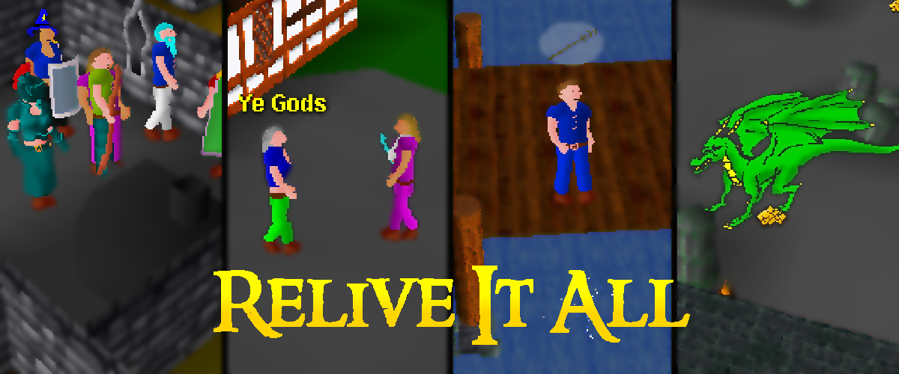
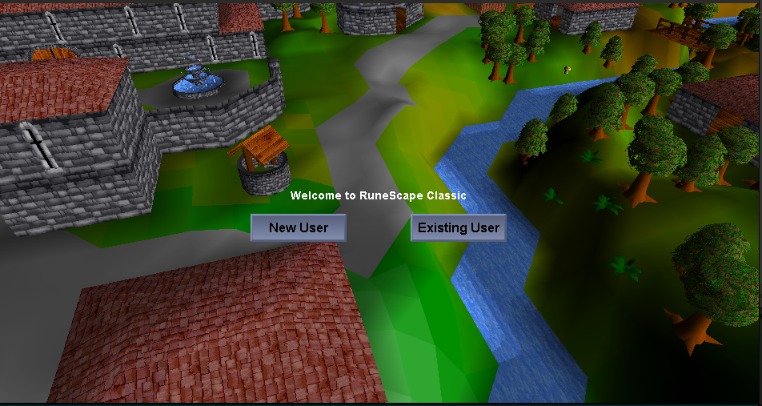
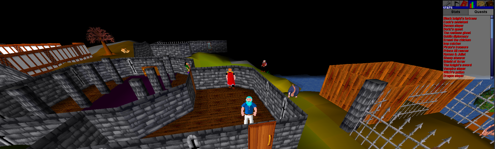
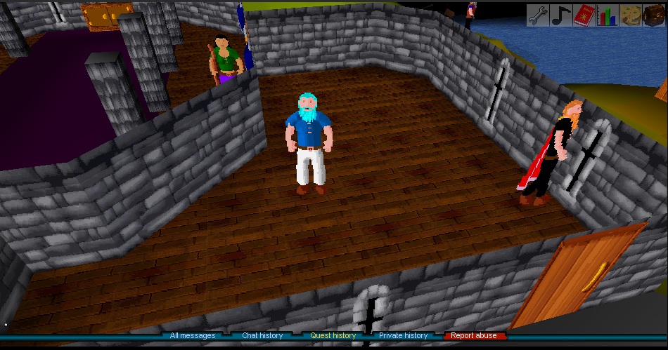

# Single-RSC

A self-contained single-player RuneScape Classic experience for desktop and Android.

**Current release:** `v2.8.2`
**Desktop:** Java 17+  
**Android:** APK included in GitHub releases  
**License:** GPL v3

Original project by [Sean Niemann](https://github.com/sean-niemann): [RSC-Single-Player](https://github.com/sean-niemann/RSC-Single-Player)

---

## Download

Get the latest release from:

https://github.com/kennethyork/Single-RSC/releases

Use:

- `Single-RSC-v2.8.2.zip` for desktop
- `Single-RSC-v2.8.2.apk` for Android

The release does not include a standalone `rsc.jar` download. The desktop zip already contains the jar and launch scripts.

### What's new in v2.8.2

- New characters now start with a complete valid RSC appearance.
- Existing saves with an incomplete appearance are repaired and returned to character design.
- Player-automation command implementations were removed from the command plugin, including `::woodcut`, `::fish`, `::mine`, and `::combat`.
- Up to 200 autonomous world bots and their ambient/Ollama conversations remain available.
- The existing configurable 1x–50x player XP behavior remains unchanged.

---

## What This Is

Single-RSC runs the game locally. There is no remote server, database, subscription, or internet requirement after download.

The goal is to make RuneScape Classic feel alive as a single-player game. The world now includes autonomous player-like bots that gather resources, fight, enter the wilderness, talk, trade, die, drop items, use shared exchange stock, and appear like players in the client.

---

## Single RS 2012 Comparison

Current comparison: **Single RS 2012 v0.15.0** and **Single-RSC v2.8.2**.

| Area | Single RS 2012 | Single-RSC |
|---|---|---|
| Bot population | 286 configured simulated players | 200-player roster with up to 80 online simultaneously |
| Player representation | Headless `Player` entities; Wilderness PKers are NPC-based | Headless `Player` entities; Wilderness bots are NPC-based |
| Skills | 25 visible skills | All 18 RSC skills |
| Real skilling | Strong native woodcutting, mining, and fishing | Broader mixture of native gathering, production, combat, and some simulated XP actions |
| Combat | 88 dedicated Wilderness PKers; the normal population is not attackable | Fighters train against NPCs; Wilderness bots attack players and each other |
| Movement | Collision-checked resource searching, regional routines, and stuck recovery | Regional travel, skilling sites, banks, route recovery, and staggered decisions |
| Social systems | Friends-list PMs, clans, clan recruitment, bot groups, and clan parties | Public chat, private bot chat, grouped chat, following, roles, and party modes |
| Ollama | Public, private, clan, and bot-to-bot conversation with persistent identities | Public, private, and grouped conversation with persistent identities |
| Trading | Player Marketplace plus fuller 2012 Grand Exchange integration | Direct bot marketplace plus shared GE-style stock |
| Grouping | Persistent regional/player groups of up to eight | Persistent skilling, combat, boss, Wilderness, and social groups |
| Highscores | Player and bot rankings across 25 skills | Player and bot rankings across 18 RSC skills, including saved XP rates |
| Saving | 30-second world autosave and shutdown save | World-bot state every 60 seconds plus normal character saving |
| Bot quests/minigames | Boss, Dungeoneering, and Pest Control helpers that do not earn XP or complete content | Party modes assist in fights, but bots do not complete quests or minigames |
| Player automation | None | Removed completely |
| Mobile | Desktop platforms only | Android client available; autonomous world bots remain desktop-only |
| XP setting | Any positive whole number at launch | 1x–50x saved per character |

Single RS 2012 remains stronger as a socially connected simulated MMO because of its larger population, Friends List integration, clans, regional routines, marketplace, and polished native resource gathering. Single-RSC is stronger at preserving the RSC presentation while providing broader classic skill coverage and more general-world combat activity.

Single-RSC is roughly 80% of the overall Single RS 2012 bot experience rather than exact parity. Its largest remaining gaps are real clan/Friends List integration, consistently native actions, richer autonomous routines, and genuine boss or minigame participation.

---

## Main Features

- Offline single-player RuneScape Classic
- Desktop and Android builds
- All 50 quests playable
- Multi-account local saves
- Hardcore mode
- Resizable desktop UI
- Configurable 1x–50x player XP multiplier
- Full music support
- Admin account and debug commands
- Autonomous world bots backed by server-side player entities
- Grand Exchange-style shared item stock at banks

---

## World Bots

World bots are autonomous, clientless server-side players that run around the world while you play.

They can:

- Walk to real trees, rocks, and fishing spots and gather from them
- Train every RSC skill through native skill, production, and combat handlers
- Bank their trips, then visibly cook, fletch, light logs, craft, or smelt saved supplies using RSC requirements and XP
- Stagger movement and decisions to support a persistent 200-bot roster without freezing the game loop
- Recover from blocked routes by trying a nearby detour or changing world
- Fight monsters
- Enter and patrol the wilderness
- Attack the player in the wilderness depending on aggression settings
- Talk naturally through a local Ollama model, with persistent identities and conversation memory
- Trade items to the player
- Deposit and withdraw items from shared Grand Exchange stock
- Gain levels
- Die, respawn, and drop inventory
- Show up like player avatars instead of normal NPCs

Right-click a visible world bot for the normal RSC-style interactions:

- **Trade with** opens that bot's marketplace
- **Follow** follows that bot
- **Group** invites that bot to your persistent activity party; choose it again to dismiss the bot
- **Stats** prints its live profile and all 18 RSC skill levels in game chat

Useful commands:

| Command | Description |
|---|---|
| `::worldbots status` | Show active world bots |
| `::worldbots settings` | Open the in-game settings menu |
| `::worldbots menu` | Same as settings |
| `::worldbots start [count]` | Start world bots |
| `::worldbots stop` | Stop world bots |
| `::worldbots top` | Show world bot leaderboard |
| `::worldbots trade` | Trade with the nearest world bot |
| `::worldbots config` | Show config values |
| `::worldbots save` | Save bot state |
| `::botchat Name\|message` | Talk privately with an online world bot |
| `::botclan message` | Talk with one of your grouped world bots |
| `::ollamastatus` | Check Ollama and the selected model |
| `::ollamamodel [model]` | Show or change the model (`reset` restores the config model) |
| `::ollamaforget` | Forget your saved conversations with bots |

The settings menu controls:

- Bot count
- Wilderness aggression
- Chat frequency
- Start/stop state

World bot settings are saved in:

```text
cache/worldbots.properties
```

World bot progress is saved in:

```text
cache/worldbots_state.properties
```

### Ollama bot conversations

World-bot speech is generated by Ollama, like Single RS 2012. Install Ollama, then install the default model:

```bash
ollama pull qwen3.5:4b
```

Keep Ollama running while you play. If it is offline or the model is missing, bots stay silent instead of
falling back to scripted dialogue. Public chat near a bot can receive a reply; nearby bots can also start and
continue conversations. Private and group conversations use the commands above.

Single-RSC and Single RS 2012 can use the same Ollama server at the same time. Each game stores its own memory
locally in its own `cache/ollama-conversations.json`. The selected model is stored in
`cache/ollama-model.properties`.

The following optional entries in `cache/worldbots.properties` control the integration:

```properties
ollama_enabled=true
ollama_url=http://127.0.0.1:11434
ollama_model=qwen3.5:4b
ollama_timeout_seconds=30
ollama_history_messages=8
ollama_public_cooldown_seconds=4
ollama_clan_cooldown_seconds=5
ollama_ambient_cooldown_seconds=18
ollama_persist_history=true
```

---

## Grand Exchange

Banks now include Grand Exchange access. Items deposited there go into shared stock that both you and bots can use.

Banker menu options include:

- Deposit tradable inventory
- Pick up an item
- Show current stock

Chat commands:

| Command | Description |
|---|---|
| `::ge list` | Show shared stock |
| `::ge deposit <itemId> [amount/all]` | Deposit an item |
| `::ge withdraw <itemId> [amount/all]` | Withdraw an item |
| `::ge depositall` | Deposit all tradable inventory |
| `::exchange ...` | Alias for `::ge` |

Bots can buy from and sell into this shared stock, so the economy gets populated as they play.

---

## Website Highscores

The website can read your private live highscore export directly from your computer, like Single RS 2012. The game creates and refreshes:

```text
cache/highscores-export.json
```

On the website, choose **Connect live highscores** and approve that file once. Supported desktop browsers remember the permission and reload current stats, online status, and world-bot activity every 30 seconds. The file is read locally and is never uploaded. Use **Choose highscore export** as a manual fallback in browsers without persistent file access.

Force an immediate save and refresh in game with:

```text
::exporthighscores
```

---

## Quick Start: Desktop

Requirements:

- Java 17 or newer

Steps:

```bash
unzip Single-RSC-v2.8.2.zip
cd Single-RSC
./run.sh
```

On Windows, run:

```bat
run.bat
```

Manual launch:

```bash
java -cp "rsc.jar:lib/*" org.nemotech.rsc.Main
```

Create a new user and log in. Create a user named `root` if you want admin privileges.

---

## Quick Start: Android

Install:

```text
Single-RSC-v2.8.2.apk
```

Player-controlled automation commands have been removed from both desktop and Android. Autonomous world bots are a desktop feature and do not control your character.

If Android blocks installation, enable installation from unknown sources for your browser or file manager.

---

## World Bot and Exchange Examples

```text
::worldbots settings
::worldbots start 200
::worldbots trade
::ge list
::ge depositall
```

There are no commands that automate your own character.

---

## General Commands

| Command | Description |
|---|---|
| `::help` | Show help |
| `::bank` | Open bank anywhere |
| `::stuck` | Move out of a stuck position |
| `::pos` | Show coordinates |
| `::toggleroofs` | Toggle roofs |
| `::mapedit` | Open map editor |

---

## Admin Account

Create a user named exactly:

```text
root
```

Admin commands include:

| Command | Description |
|---|---|
| `::tele <location>` | Teleport to named location |
| `::tele <x> <y>` | Teleport to coordinates |
| `::town <location>` | Teleport to town |
| `::item <id> [amount]` | Spawn item |
| `::npc <id>` | Spawn NPC |
| `::object <id> [dir]` | Spawn object |
| `::set <skill> <level>` | Set skill level |
| `::addbank <id> [amount]` | Add item to bank |
| `::removebank <id> [amount]` | Remove item from bank |
| `::quest <id> <stage>` | Set quest stage |
| `::find <entity> <name>` | Search entities |
| `::debugobjects [radius]` | List nearby objects |

Admin users can also right-click the mini-map to teleport.

---

## Hardcore Mode

Hardcore mode can be enabled when creating a character.

If a hardcore character dies:

- The save file is permanently deleted
- The client closes
- Logging in again starts fresh

Back up saves manually if you want a recovery point.

---

## Building Desktop

Requirements:

- Java 17+
- `lib/gson-2.6.2.jar` included in the repo

Build:

```bash
bash compile.txt
```

This produces:

```text
rsc.jar
```

---

## Building Android

The Android project is in:

```text
Single-RSC-Mobile/
```

Build a release APK:

```bash
cd Single-RSC-Mobile
./gradlew clean assembleRelease
```

Output:

```text
Single-RSC-Mobile/app/build/outputs/apk/release/Single-RSC.apk
```

---

## Project Layout

```text
Single-RSC/
├── rsc.jar
├── run.sh
├── run.bat
├── compile.txt
├── cache/
│   ├── data/
│   ├── audio/
│   ├── jags/
│   └── players/
├── lib/
├── src/
│   └── org/nemotech/rsc/
│       ├── bot/
│       ├── client/
│       ├── model/
│       └── plugins/
└── Single-RSC-Mobile/
```

Important bot files:

| File | Purpose |
|---|---|
| `src/org/nemotech/rsc/bot/WorldBotManager.java` | Autonomous world bots |
| `src/org/nemotech/rsc/model/GrandExchange.java` | Shared exchange stock |
| `src/org/nemotech/rsc/plugins/commands/BotCommands.java` | World-bot and GE commands |
| `src/org/nemotech/rsc/plugins/npcs/Bankers.java` | Bank/Grand Exchange menu |

---

## Media






---

## FAQ

**Does this connect to a real MMO server?**  
No. It runs locally as a single-player game.

**Are the world bots real players?**  
They are local AI-controlled server-side `Player` entities without separate graphical clients. They use normal player stats, inventories, movement, skill handlers, and combat systems.

**Do desktop and Android have the same updates?**  
No. Android is a separate mobile build. Desktop world-bot features are not automatically present in Android.

**Where are saves stored?**  
Player saves are stored locally under the game cache/player save directories.

**Can bots buy my items?**  
Yes. Bots can interact with shared Grand Exchange stock, and nearby world bots can trade directly with you.

**How do I make wilderness bots less aggressive?**  
Use `::worldbots settings` and lower aggression.

---

## Disclaimer

This project is a preservation and educational single-player reimplementation. Original game assets, names, and concepts belong to their respective owners.

---

## License

GPL v3.0. See [LICENSE](LICENSE).
